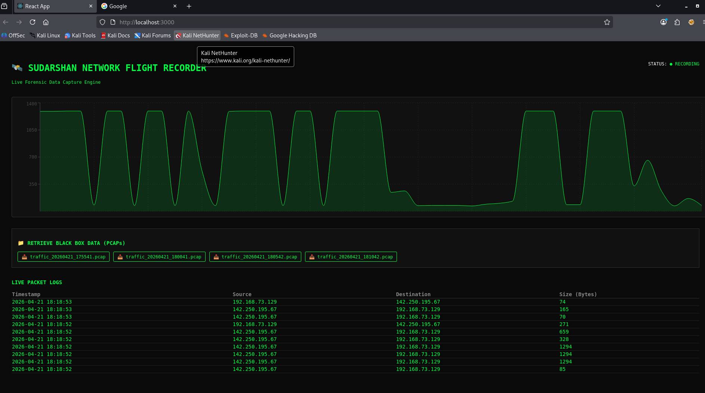
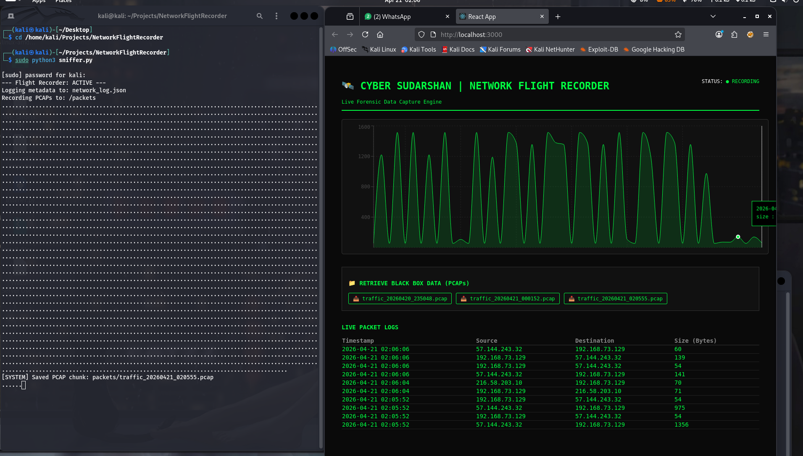
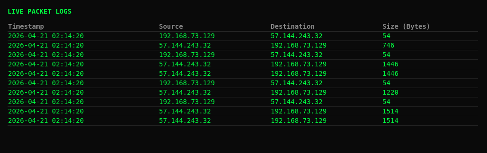
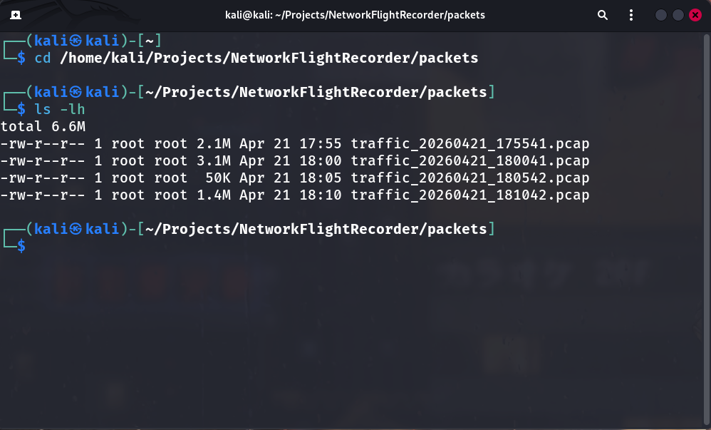
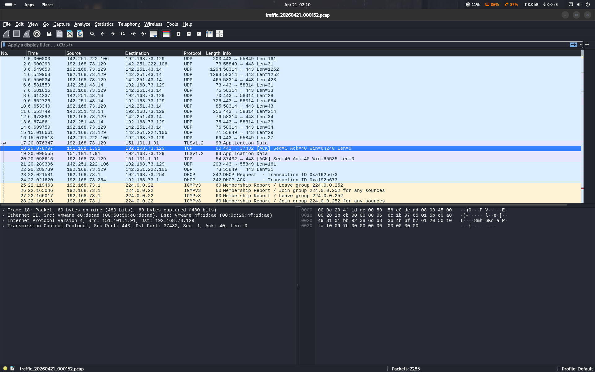

# 🛡️ Sudarshan Network Flight Recorder

> *"A Black Box for your computer network."*

A full-stack **Network Detection and Response (NDR)** tool that turns raw network traffic into actionable security intelligence. Built for continuous, long-term monitoring without crashing your system.



---

## 📌 What Is This?

Just like an airplane's flight recorder captures everything before a crash, **Sudarshan Net-FR** records every digital conversation on your network — 24/7 — so you always have evidence ready when something goes wrong.

It solves the core problem with tools like Wireshark: **Wireshark crashes after hours of use** because it stores everything in RAM. This tool uses a rolling buffer system so you always have the *last hour* of raw packet evidence on disk, without ever running out of storage.

---

## ✨ Features

| Feature | Description |
|---|---|
| 🔴 **Live Traffic Graph** | Real-time visualization of network activity, updated every 1–2 seconds |
| 🗃️ **Forensic Metadata Logging** | Extracts Source IP, Destination IP, Protocol, and Packet Size into JSON |
| 🔁 **Rolling PCAP Buffer** | Saves raw traffic in 5-minute chunks; oldest files auto-delete to protect disk space |
| 📥 **Incident Retrieval** | Download any specific time window as a `.pcap` file for deep analysis in Wireshark |
| 🌐 **Remote-Ready Dashboard** | Web-based UI means you can monitor a server in one city from a laptop in another |

---

## 📸 Screenshots

### 1. Sniffer Running — The Engine is Live
> Start here. This is what you see in your terminal when the packet capture is active.



---

### 2. Live Dashboard — Real-Time Wave Graph
> The React dashboard showing the live pulse of your network traffic.


---

### 3. Forensic Metadata Table — Who is Talking to Whom
> Every packet logged with Source IP, Destination IP, Protocol, and Size — no heavy file parsing needed.



---

### 4. PCAP Evidence Files — The Rolling Buffer
> The `packets/` folder showing auto-generated 5-minute `.pcap` chunks with timestamps.



---

### 5. Wireshark Analysis — Deep Forensic Dive
> Opening a recorded `.pcap` file in Wireshark for full packet-level investigation.



---

## 🏗️ Architecture

The project uses a **3-Layer Architecture** to keep capture fast and the UI responsive.

```
┌─────────────────────────────────────────────────────┐
│  Layer 3 · THE COCKPIT  (React + Recharts)          │
│  Live dashboard — polls API every 1–2s              │
├─────────────────────────────────────────────────────┤
│  Layer 2 · THE BRIDGE   (Node.js + Express)         │
│  REST API — reads JSON logs, serves to frontend     │
├─────────────────────────────────────────────────────┤
│  Layer 1 · THE ENGINE   (Python + Scapy)            │
│  Packet capture — multi-threaded, writes PCAP+JSON  │
└─────────────────────────────────────────────────────┘
```

### Layer 1 — The Engine (`sniffer.py`)
- Hooks into the Network Interface Card (NIC) using **Scapy**
- Runs in **multi-threaded mode**: one thread captures packets, another flushes data to disk
- Outputs raw traffic as `.pcap` files and metadata as `network_log.json`

### Layer 2 — The Bridge (`backend/server.js`)
- **Node.js + Express** server acts as the translator between disk and browser
- Watches the output folder and serves the latest log data via a REST API
- Required because browsers cannot directly access the filesystem for security reasons

### Layer 3 — The Cockpit (`dashboard/`)
- **React** frontend polls the API every 1–2 seconds for live updates
- Uses **Recharts** to render a real-time packet-size wave graph
- Displays a metadata table: who is talking to whom, on what protocol

---

## 📁 Project Structure

```
NetworkFlightRecorder/
├── sniffer.py                        # Layer 1: Packet capture engine
├── network_log.json                  # Live metadata output (auto-generated)
├── packets/                          # Rolling PCAP storage (auto-managed)
│   └── traffic_YYYYMMDD_HHMMSS.pcap
├── backend/
│   ├── server.js                     # Layer 2: Express API server
│   └── package.json
├── dashboard/
│   ├── src/
│   │   ├── App.js                    # Layer 3: React dashboard
│   │   └── App.css
│   └── package.json
└── assets/
    └── screenshots/                  # Project screenshots for README
        ├── 01_sniffer_running.png
        ├── 02_dashboard_live.png
        ├── 03_metadata_table.png
        ├── 04_pcap_files.png
        └── 05_wireshark_analysis.png
```

---

## 🚀 How to Run

> **Prerequisites:** Python 3, Node.js, npm, Scapy (`pip install scapy`)

### Step 1 — Start the Packet Sniffer

```bash
sudo python3 sniffer.py
```

> `sudo` is required to access the network interface card.


### Step 2 — Start the API Server

```bash
cd backend
node server.js
```

### Step 3 — Launch the Dashboard

```bash
cd dashboard
npm install   # first time only
npm start
```

Open **http://localhost:3000** in your browser. The live graph will begin populating immediately.


---

## 🔬 Sudarshan Net-FR vs Wireshark

| | Wireshark | Sudarshan Net-FR |
|---|---|---|
| **Long-term monitoring** | ❌ Crashes — stores all data in RAM | ✅ Rolling buffer, auto disk management |
| **Storage management** | ❌ Manual | ✅ Automatic — oldest files self-delete |
| **Remote monitoring** | ❌ Must be on the same machine | ✅ Web dashboard, accessible remotely |
| **At-a-glance analysis** | ❌ Raw packet dump, requires expertise | ✅ Live graph + metadata table |
| **Deep forensic analysis** | ✅ Best-in-class | ✅ Export PCAP → open in Wireshark |

*Both tools are complementary. Sudarshan Net-FR handles long-term detection; Wireshark handles deep forensic analysis.*


---

## 🛠️ Tech Stack

- **Python 3** + **Scapy** — Packet capture
- **Node.js** + **Express** — REST API backend
- **React** + **Recharts** — Live dashboard frontend

---

## ⚠️ Legal & Ethical Notice

This tool is intended for use **only on networks you own or have explicit written permission to monitor**. Unauthorized network interception is illegal under the IT Act, 2000 (India) and equivalent laws worldwide. Use responsibly.

---

## 👤 Built by

**Yatendra Dixit**
*B.Tech(Cyber Security) | Cybersecurity Enthusiast*

*This Project is built to bridge the gap between high-level traffic visualization and low-level packet forensics.*

[](https://www.linkedin.com/in/yatendradixit05)
